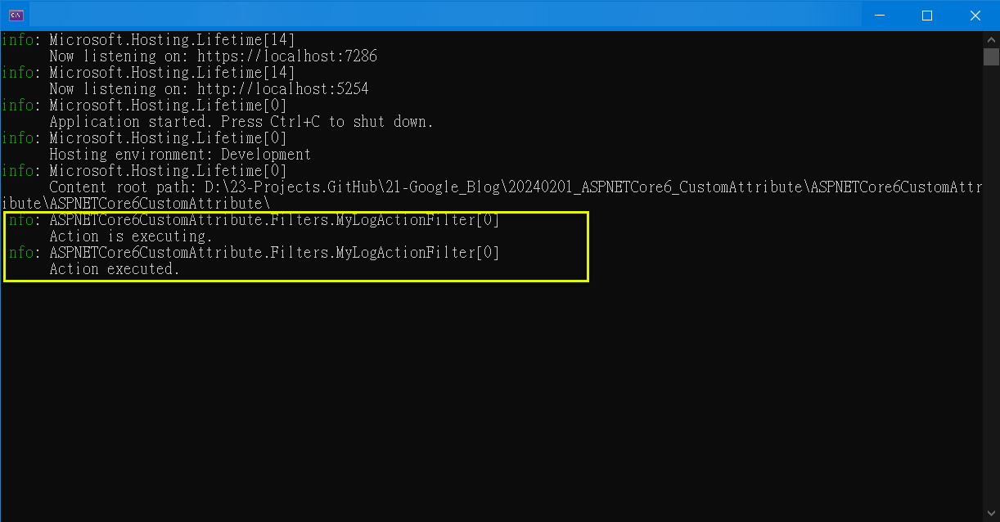

## 如何在 ASP.NET Core 6 MVC 撰寫具有 相依注入(DI) 的自訂屬性 (Custom Attribute)
How to write Custom Attribute with DI in ASP.NET Core 6 MVC   

## 前言

由於 ASP.NET Core 6 MVC 專案採用 DI (Dependency Injection) 的方式, 有一些相關的 自訂屬性 (Custom Attribute) 也想採用 DI. 

原本程式碼是在 MyLogAttribute 裡面自行 new Logger(), 在套用屬性時, 是用 [MyLogAttribute]; 改採 DI 後, 變成建構子要傳入 ILogger 的參數, 在 HomeController 的 Index() method, 要改成以下的方式, 但編譯會出現 CS0181 及 CS0120 的編譯錯誤.  

```csharp
[MyLogAttribute(_logger)]
public IActionResult Index() {
    return View();
}
```

參考文件1.. 為 CS0181 的說明, 它提到自訂屬性傳入的參數, 不可以是物件變數, 必須為常數值.  
本文主要採 參考文件2.. 的方法2 (ServiceFilter) 進行演練及實作.  

完整範例可由 GitHub 下載.  

<!--more-->

## 演練細節

### 步驟_1: 建立 ASP.NET Core 6 MVC 專案

### 步驟_2: 加入 MyLogActionFilter.cs

```csharp
public class MyLogActionFilter : IActionFilter
{
	private readonly ILogger<MyLogActionFilter> _logger;

	public MyLogActionFilter(ILogger<MyLogActionFilter> logger)
	{
		_logger = logger;
	}

	public void OnActionExecuting(ActionExecutingContext context)
	{
		_logger.LogInformation("Action is executing.");
	}

	public void OnActionExecuted(ActionExecutedContext context)
	{
		_logger.LogInformation("Action executed.");
	}
}
```

### 步驟_3: 加入 MyLogAttribute.cs

直接採用 public class MyAttribute : ActionFilterAttribute 會失敗, 因為沒有實作 IFilterFactory 的 CreateInstance() method !!!   

這裡必須實作 IFilterFactory 的 CreateInstance() 方法, 透過 IServiceProvider 去取得預計在 DI 註冊的 MyLogActionFilter 物件.  

```csharp
[AttributeUsage(AttributeTargets.Class | AttributeTargets.Method)]
public class MyLogAttribute : Attribute, IFilterFactory, IFilterMetadata
//public class MyAttribute : ActionFilterAttribute
{
	public bool IsReusable => false;

	public IFilterMetadata CreateInstance(IServiceProvider serviceProvider)
	{
		return serviceProvider.GetRequiredService<MyLogActionFilter>();
	}
}
```

### 步驟_4: 在 Program.cs 註冊 MyLogActionFilter

```csharp
var builder = WebApplication.CreateBuilder(args);

// Add services to the container.
builder.Services.AddControllersWithViews();
builder.Services.AddScoped<MyLogActionFilter>();

var app = builder.Build();
```

### 步驟_5: 在 HomeController 的 Index() 方法, 套用 [MyLogAttribute] 屬性

```csharp
[MyLogAttribute]
public IActionResult Index()
{
	return View();
}
```

### 步驟_6: 實測驗證
  

## 結論

一旦習慣用 DI 以後, 真的很難回去自己去建立物件實體了, 會想要盡可能將程式都用 DI 的方式處理, 以利程式之間的關聯為鬆散耦合的狀態.  

當然, 有些程式明顯容易 DI (例如 service 層), 但有些就不是那麼明顯 (例如 自訂屬性), 需要額外作一些處理.    
## 參考文件

* <a href="https://learn.microsoft.com/en-us/dotnet/visual-basic/misc/bc30045" target="_blank">1.. (Microsoft Learn) [CS0181] Attribute constructor has a parameter of type '<type>', which is not an integral</a>  
```ini
A custom attribute definition includes a constructor that specifies an invalid data type for a parameter. Attributes can take only certain data types as parameters, because only those types can be serialized into the metadata for the assembly.

Change the data type of the parameter to Byte, Short, Integer, Long, Single, Double, Char, String, Boolean, System.Type, or an enumeration type.
```

* <a href="https://blog.iamdavidfrancis.com/posts/aspnet-filter-dependency-injection/" target="_blank">(David Francis) Using Dependency Injection in Asp.Net Core Filters & Attributes</a>  
```ini
這篇有提到 2 個方法可以處理要進行相依注入的自訂屬性 Custom Attribute 的問題.

TypeFilter:  
優點: 能夠在每次請求時實例化過濾器, 可以傳入常數值的參數, 提供更大的靈活性. 
缺點: 可能會增加系統的負擔, 因為每次請求都會創建一個新的過濾器實例. 

ServiceFilter:  
優點: 由於直接從DI容器中獲取過濾器實例, 可以更好地利用DI容器的管理和生命週期功能, 減少重複創建實例的開銷. 
缺點: 相較於TypeFilter, 它提供的自定義能力和靈活性可能會略低.
```


